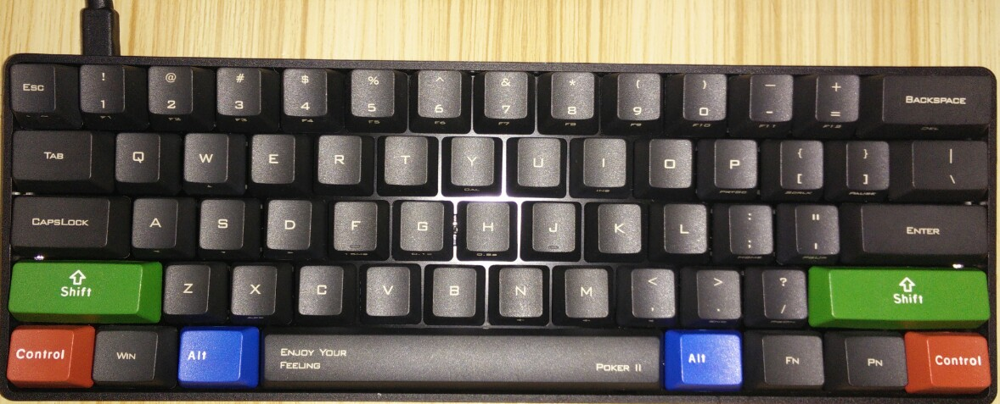

# Poker 2 #
  
  
## 参数 ##
  
1. 键数： 61 键( *US* 配置)  
2. 尺寸： 29.5 * 10.2 * 3.8 CM (**非常小，非常小，非常小！！！**)  
  
## 主要功能 ##
  
1. 方便携带。  
2. 60% 键盘搭配 *QWERTY* 配置(61键)。  
3. *Cherry MX* 系列轴(黑、青、茶、红)。  
4. 双层板 *PCB*。  
5. 键帽材质: *ABS、PBT*。  
6. *LED* 背光功能。  
7. *USB* 界面。  

## FN 特殊功能 ##
  
1. *FN + SPACE* ---> 切换 *W、A、S、D* 与方向键**上下左右**。
	可以使用 *FN + W、A、S、D* 组合键进行方向操作。  
2. *FN + Z* ---> 把 *SHIFT* 键变成按一下一直发码，再按一下停止发码。
	再次按下该组合键，则 *SHIFT* 回复到正常状态。  
  